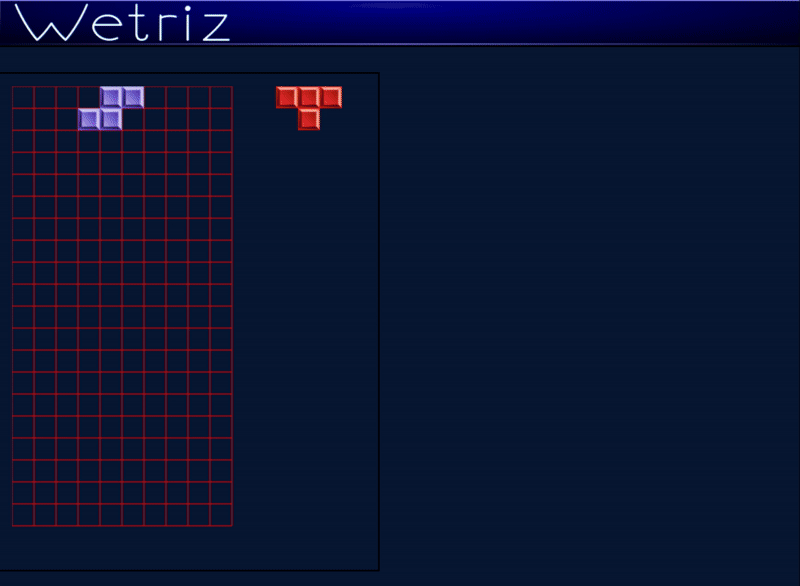

# Wetriz
Tetris grid implemented in JavaScript.

## Disclaimer 1: this is ancient code! 🦖
The code I am sharing in this repository is old: if I had to write it today, I would
certainly use TypeScript. I wrote the first implementation of my JavaScript web tetris
before the HTML5 Canvas was available in most browsers, and the first implementation even
supported **Internet Explorer 6**! The code I share here is an adaptation of that
older code, to use HTML5 Canvas and to use a tiny solution for dependency management
I wrote when I was still coding in plain JavaScript (R.js).

My first web Tetris was a full web application, supporting:
* scores
* games saved to a MySQL database
* increasing game speed to several levels depending on the score
* user account creation
* user's preference with the possibility to play with different game styles and custom background images
* wall of fame with higher scores and last played games

Implementing that web Tetris helped me getting a good job in Poland and it's
thanks to that work, made for passion, that I live in Poland today.

I later made a second version of the web Tetris that supported also playing
using mobile devices, and swipe events.

---

## Disclaimer 2: this code supports only playing with a KeyBoard (no mobile support!)

A past implementation of the Wetriz supported playing with mobile devices and
touch events, but the code here is only a work in progress of a better version,
not completed and not handling swipe events.

---

## Other notes

The code here might be interesting for a "museum" of coding, since it shows how
prototypes could be extended and custom events handled back in times when
classes were not available in ECMAScript.

The pictures under `/images/` were created by myself using GIMP and Inkscape.
